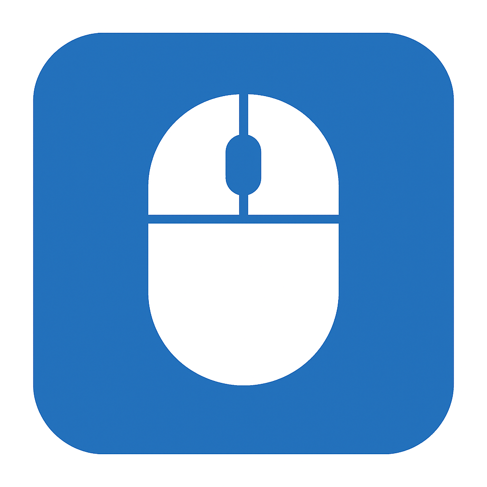

                                                                                  The Mouse Reset Position app
to reset position press "home" to open the ui press "home + end"
You have to have python and these packages
pip install pyautogui
pip install keyboard
pip install pillow
If you want to build you need pyinstaller 
pip install pyinstaller
cd "The app location"
pyinstaller --onefile --noconsole --icon=mouse_icon.ico Mouse.py
To run the app go in to the build folder and there is a .exe run it it is called Mouse

